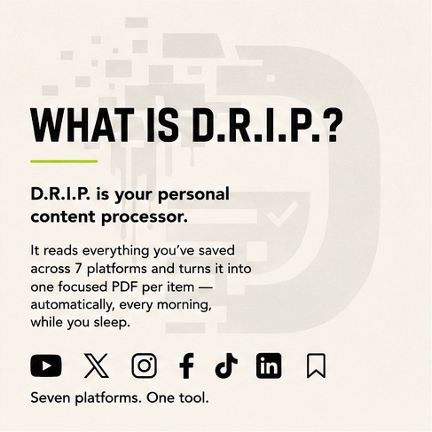
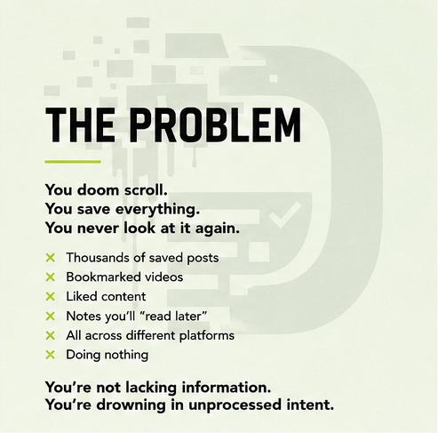
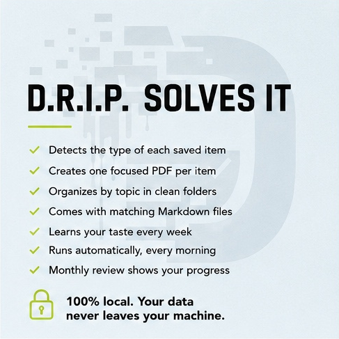

<p align="center">
  
</p>

<h1 align="center">D.R.I.P. — Digitally Retained. Intelligently Processed.</h1>

<p align="center">
  <a href="https://thebvl.gumroad.com/l/rvwbcv"></a>
  
  
  
  
</p>

<p align="center"><strong>Turn everything you've ever saved into something you actually use.</strong></p>

---

<p align="center">
  
  
  
</p>

---

D.R.I.P. reads your saved content across YouTube, X, Instagram, Facebook, TikTok, LinkedIn, and your browser bookmarks — then converts each saved item into a structured, focused PDF tailored to what the content actually is. Recipe? A formatted recipe with ingredient table and method steps. Workout? A training plan with exercise tables. Podcast? A discussion summary with key topics and guest insights. Strategy article? A deep-dive document with sections, actions, and source attribution.

It runs every morning while you sleep. By the time you sit down at your desk, your saved content is sitting on disk as PDFs you can actually use — and it gets better at understanding your taste every week through a built-in self-learning loop.

**Runs natively on macOS, Windows, and Linux.** One installer per system, OS-native scheduling, identical output everywhere.

---

## What's New in This Build

If you used an earlier version of D.R.I.P., here's what changed:

- **Per-item PDFs.** Each saved item now becomes its own focused PDF instead of being grouped with unrelated saves. Open a Workouts PDF and it's about ONE workout — not three workouts plus an unrelated podcast.
- **Self-learning loop.** Two new commands (`feedback` and `autoimprove`) build a personalised classifier from your ratings over time. The AI gets measurably better at sorting your specific content every week.
- **Collection proposals.** When 5+ items share a theme in a single run, D.R.I.P. asks if you want them combined into one document — you choose.
- **Podcast as a first-class category.** Joe Rogan, Lex Fridman, Diary of a CEO, and similar long-form interviews now generate proper discussion-summary PDFs instead of being mis-sorted as fitness or business.
- **Smart questions that adapt.** End-of-run questions now reference the actual content you reviewed — guest names, exercise names, recipe ingredients — never generic templates.
- **PDF watermark + table wrapping.** Every PDF carries a subtle D.R.I.P. watermark behind the text, and exercise/recipe tables now wrap long entries instead of truncating them.
- **Anti-hallucination rules.** Generation prompts now include hard constraints that prevent the LLM from inventing exercise names, ingredients, or facts not present in the source.
- **Excel trackers removed.** Replaced with the per-item PDF flow, which provides real value instead of a row-by-row log.

---

## Why D.R.I.P. Doesn't Download Videos

Most tools that process video content download the file first — consuming gigabytes of storage and putting you in grey territory with platform terms of service. D.R.I.P. doesn't.

**D.R.I.P. reads subtitles and captions only.** No video file is ever stored on your machine. For the small share of videos that have no captions, it downloads audio only to a temporary file, transcribes it locally with Whisper, and deletes the audio the moment transcription finishes. Full video files are never downloaded. Your storage stays clean, your ToS risk is minimal, and the full intelligence of the content is still extracted.

This is not a compromise. It's the right architecture.

---

## What You Get Every Run

D.R.I.P. detects what type of content each saved item is and generates the right document for it automatically. Each item gets its own PDF in a topic-specific folder so you can browse by category:

| Content Type | Folder | What you get |
|---|---|---|
| Recipe / Food | `PDFGuides/Recipes/` | Ingredient table (imperial + metric), numbered method, tips |
| Exercise / Training | `PDFGuides/Workouts/` | Exercise table (sets/reps/rest), warm-up, cool-down, progression |
| Podcast / Interview | `PDFGuides/Podcasts/` | Guest, host, key topics, notable quotes, takeaways |
| Strategy / Business | `PDFGuides/Business/` | Sections, action items, source attribution |
| Tech / Learning | `PDFGuides/Tech/` | Step-by-step guide, key concepts, references |
| Motivation / Mindset | `PDFGuides/Motivation/` | Themes, action items, reflective notes |
| Travel / Lifestyle | `PDFGuides/Travel/` | Destinations, tips, planning notes |
| Mixed / Inbox | `PDFGuides/Inbox/` | Digest format — for content that doesn't fit the categories above |
| Approved combinations | `PDFGuides/Collections/` | Multi-item documents (when you approve a proposal) |
| Monthly | `PDFGuides/review-YYYY-MM.pdf` | Synthesis review of what you've been studying |

Every PDF comes with a matching Markdown file in `Markdown/<same-folder>/`. Each folder also keeps a `latest-<type>.pdf` convenience copy.

---

## The Self-Learning System

D.R.I.P. comes with a Karpathy-inspired self-improvement loop that runs entirely on your machine — no model retraining, no GPU, just in-context learning that compounds week over week.

### How it works

1. **Generate** — DRIP scrapes and produces PDFs as usual.
2. **Rate** — You run `drip_manager.py feedback` and tap `k` (keep) or `t` (trash) per PDF. Takes 30 seconds for a day's worth.
3. **Learn** — Trashed PDFs become training signal: the AI derives a one-line rule from each mistake and stores it.
4. **Improve** — Every future run injects those learned rules into the classifier prompt as few-shot examples. The classifier gets personalised to your actual content.
5. **Autoimprove (optional)** — Run `drip_manager.py autoimprove` for an experiment loop that generates new candidate rules, tests them against your verified examples, and commits the winners. Karpathy's autoresearch loop, scaled to your laptop.

### What it produces

Three growing files in `Memory/`:

- `feedback.json` — Every rating you've given, with timestamps.
- `evaluation_cache.json` — Verified test cases (title + correct theme). Used to measure classifier accuracy over time.
- `classification_corrections.json` — Items DRIP got wrong, with the correct answer.
- `learned_rules.txt` — Plain-English rules the AI has derived. Open and read it any time.

After 2 weeks of regular feedback, the classifier scores much higher on your actual content than any generic prompt ever could — because it's seen your patterns.

### Goals you can edit

`autoimprove/goals.md` defines what "better" means: accuracy targets, hallucination targets, engagement targets. Edit this file to change what the autoimprove loop optimises for.

---

## Collection Proposals

When a single run produces 5 or more items in the same theme (say, 6 workout videos), DRIP doesn't auto-combine them — that produced bad output in earlier versions. Instead it **proposes** the combination and saves it for your review.

Run `drip_manager.py collections` when you have a moment. DRIP shows you each proposal:

```
[1/3]  Fitness Collection  —  6 items
        - Top 5 Hip Mobility Drills
        - 7 Core Exercises for Low Back Pain
        - Shoulder Mobility Flow
        - ...

Combine these into one document? [y/n]:
```

Approve → DRIP generates a combined PDF in `PDFGuides/Collections/`. Decline → the items stay as separate per-item PDFs. You stay in control of what gets bundled.

---

## Seven Platforms Supported

| Platform | What D.R.I.P. reads |
|---|---|
| YouTube | All Library playlists — auto-discovered (Watch Later, Liked, Mobility, etc.) |
| X (Twitter) | Bookmarks |
| Instagram | Saved posts |
| Facebook | Saved posts |
| TikTok | Favourites |
| LinkedIn | Saved posts |
| Browser Bookmarks | Chrome, Chromium, Brave, and Edge auto-detected on every OS; Safari on macOS; any other browser via an exported `bookmarks.html` |

D.R.I.P. uses your existing browser session — no passwords, no OAuth tokens, no third-party logins. Cookies stay on your machine.

---

## AI — Your Choice, Your Cost

D.R.I.P. is fully AI-agnostic:

| Option | How | Privacy | Cost |
|---|---|---|---|
| **Local AI (Ollama)** | Any model you have pulled | 100% local, nothing sent anywhere | Free |
| **Local AI (LM Studio)** | Any model via LM Studio server | 100% local | Free |
| **Anthropic (Claude)** | API key in config | Content sent to Anthropic | Pay per run |
| **OpenAI (GPT)** | API key in config | Content sent to OpenAI | Pay per run |
| **xAI (Grok)** | API key in config | Content sent to xAI | Pay per run |
| **Auto** | Local first — cloud fallback if local fails | Local whenever possible | Free until fallback |

Set `"provider": "auto"` in `config.json` and D.R.I.P. handles the rest. See [`AI-SETUP.md`](AI-SETUP.md) for full setup instructions including which local models work best with each content type.

---

## Quick Start

> Commands shown as `venv/bin/python …` are for **macOS / Linux**. On **Windows**, use `venv\Scripts\python …` instead — everything after the interpreter is identical on all three systems.

### 1 — Install

**macOS / Linux:**
```bash
bash install.sh
```

**Windows (PowerShell):**
```powershell
powershell -ExecutionPolicy Bypass -File install.ps1
```

Creates the Python environment, installs all dependencies, and registers the daily 8 AM background run for your OS. Takes 2–3 minutes on first run.

### 2 — Connect your accounts

```bash
venv/bin/python setup_cookies.py
```

Walks you through exporting cookies from your browser using the D.R.I.P. Chrome extension (in the `extension/` folder). Follow the prompts in your terminal.

### 3 — Add your usernames to `config.json`

Open `config.json` and fill in your handles where prompted:

```json
"x":         { "enabled": true, "username": "yourhandle" },
"instagram": { "enabled": true, "username": "yourhandle" },
"tiktok":    { "enabled": true, "username": "yourhandle" },
"linkedin":  { "enabled": true, "username": "your-linkedin-vanity" }
```

YouTube, Facebook, and bookmarks detect your session automatically — no username needed.

### 4 — Run it

**macOS / Linux:**
```bash
bash run_drip.sh
```

**Windows (PowerShell):**
```powershell
powershell -ExecutionPolicy Bypass -File run_drip.ps1
```

D.R.I.P. scans your platforms, asks a few onboarding questions (once only), and generates your first PDFs. From here it runs itself every morning at 8 AM.

### 5 — Rate the first batch

After your first run or two, build the self-learning signal:

```bash
venv/bin/python drip_manager.py feedback
```

Rate each PDF with `k` (keep) or `t` (trash). Takes 30 seconds. The AI starts learning your taste from this point forward.

---

## Personalisation

On first run D.R.I.P. asks you seven onboarding questions — your goal, what to focus on, what to ignore, output depth, schedule preference, platforms, and provider. Answers are saved permanently and shape every output from that point forward.

You can also edit `Memory/user-preferences.txt` in plain English at any time:

```
I'm a freelance designer learning Swift on the side.
Prioritise design systems, typography, and iOS development.
Flag anything about freelance pricing or client management.
Ignore entertainment and music content.
```

D.R.I.P. reads this at the start of every run.

After each run, D.R.I.P. asks 3-5 smart questions about the content it just processed. Your answers (saved in `Memory/answers.json`) feed back into every future generation — making each PDF more personal than the last.

---

## Management Commands

The Python subcommands are identical on every OS — only the interpreter path changes (`venv/bin/python` on macOS/Linux, `venv\Scripts\python` on Windows).

```bash
# Run D.R.I.P. now (one platform per run, auto-rotates each run)
bash run_drip.sh                                  # macOS / Linux
powershell -ExecutionPolicy Bypass -File run_drip.ps1   # Windows

# Rate recent PDFs to train the self-learning loop
venv/bin/python drip_manager.py feedback

# Run the self-improvement experiment loop
venv/bin/python drip_manager.py autoimprove

# Review and approve collection proposals
venv/bin/python drip_manager.py collections

# Answer questions saved during background runs
venv/bin/python drip_manager.py questions

# Generate a monthly synthesis review of everything processed
venv/bin/python drip_manager.py review

# Redo the first-run setup questions
venv/bin/python onboarding.py --reset
```

**View today's run log:**
```bash
tail -f Logs/drip-$(date +%Y-%m-%d).log                              # macOS / Linux
Get-Content ".\Logs\drip-$(Get-Date -Format yyyy-MM-dd).log" -Wait   # Windows
```

**Stop / re-enable the daily background service:**
```bash
# macOS
launchctl unload ~/Library/LaunchAgents/com.drip.agent.plist
launchctl load   ~/Library/LaunchAgents/com.drip.agent.plist

# Linux
systemctl --user stop  com.drip.agent.timer
systemctl --user start com.drip.agent.timer

# Windows (PowerShell)
Disable-ScheduledTask -TaskName "DRIP Agent"
Enable-ScheduledTask  -TaskName "DRIP Agent"
```

---

## Folder Structure

```
D.R.I.P/
├── PDFGuides/                  Generated PDFs, organised by topic
│   ├── Workouts/                 One PDF per saved workout video
│   ├── Recipes/                  One PDF per saved recipe
│   ├── Podcasts/                 One PDF per saved podcast / interview
│   ├── Business/                 Strategy / sales / entrepreneurship guides
│   ├── Tech/                     Software / AI / tools / how-to
│   ├── Motivation/               Mindset / habits / personal growth
│   ├── Travel/                   Destinations / lifestyle / travel tips
│   ├── Health/                   Health, recovery, wellness journeys
│   ├── Inbox/                    Mixed-theme digests (low-confidence items)
│   └── Collections/              Combined documents you approved via `collections`
│
├── Markdown/                   Markdown companion for every PDF (same folder layout)
│
├── Memory/                     Everything D.R.I.P. knows about you
│   ├── user-preferences.txt      Edit in plain English to personalise output
│   ├── onboarding.json           Your first-run setup answers
│   ├── answers.json              Your responses to smart questions
│   ├── pattern-history.json      Auto-tracked content patterns
│   ├── topic-history.json        Per-theme history across runs
│   ├── run-log.json              Log of every run
│   ├── pending-collections.json  Collection proposals awaiting your approval
│   ├── feedback.json             Your keep/trash ratings (from `drip feedback`)
│   ├── evaluation_cache.json     Verified test cases for the self-learning loop
│   ├── classification_corrections.json  Misclassified items you corrected
│   └── learned_rules.txt         Plain-English rules the AI has learned
│
├── autoimprove/                Self-improvement layer
│   └── goals.md                  Edit to define what "better" means for your DRIP
│
├── SavedData/                  Internal state tracking
│   ├── seen_items.json           IDs of items already processed (so they're not re-run)
│   └── platform_queue.json       Tracks which platform is next in the rotation
│
├── Logs/                       Daily run logs
│
├── cookies/                    Browser session cookies (local only, chmod 600)
│
├── extension/                  The D.R.I.P. Chrome extension for cookie export
│
├── scrapers/                   One module per supported platform
│
├── generators/                 PDF + Markdown builders
│
├── static/                     Brand assets (watermark, favicon)
│
├── config.json                 All settings — AI provider, platforms, schedule, depth
│
├── AI-SETUP.md                 AI backend setup (start here if using cloud API)
├── HOW-TO-USE.md               Full usage guide
├── FAQ.md                      Common questions and troubleshooting
│
├── install.sh                  One-command installer (macOS / Linux)
├── install.ps1                 One-command installer (Windows)
├── run_drip.sh                 Manual run script (macOS / Linux)
├── run_drip.ps1                Manual run script (Windows)
├── reset.sh                    Clear all generated content + state (start fresh)
├── setup_cookies.py            Cookie pipeline (paired with the Chrome extension)
├── onboarding.py               First-run setup wizard
├── drip_manager.py             Main orchestrator — all subcommands live here
├── memory_manager.py           Persistent memory + self-learning storage
├── content_processor.py        Classification + LLM generation
├── state_manager.py            Item tracking + platform rotation
├── com.drip.agent.plist        macOS launchd schedule for daily background runs
├── com.drip.agent.service      Linux systemd service unit
└── com.drip.agent.timer        Linux systemd timer (daily 8 AM trigger)
```

---

## Security

- **Cookies** are stored in `cookies/` with owner-only permissions (`chmod 600` on macOS/Linux; locked to your user account on Windows). No other user on your machine can read them.
- **Cookies contain session tokens only — never passwords.**
- **Nothing in D.R.I.P. uploads, syncs, or transmits your cookies or scraped content to any server.**
- When using a local AI (Ollama / LM Studio), your content never leaves your machine at all.
- The Memory folder (your answers, ratings, learned rules) is also local-only and never transmitted.
- The Chrome extension that exports your cookies runs entirely on your machine — it POSTs only to `localhost:7331`, never to the internet.

---

## Schedule

By default D.R.I.P. runs every morning at 8 AM using your operating system's native scheduler — `launchd` on macOS, a `systemd` user timer on Linux, and Task Scheduler ("DRIP Agent") on Windows. The installer sets this up for you.

To change the run time:
- **macOS** — edit the `<key>Hour</key>` / `<key>Minute</key>` values in `com.drip.agent.plist`, then reload it.
- **Linux** — edit `OnCalendar=` in `~/.config/systemd/user/com.drip.agent.timer`, then `systemctl --user daemon-reload`.
- **Windows** — open Task Scheduler, find **DRIP Agent**, and edit its daily trigger.

One platform is scraped per run, rotating through your enabled list. This is intentional — it spreads the work, keeps each run fast, and lets the self-learning loop converge faster on per-platform patterns.

---

## Support

Read [`FAQ.md`](FAQ.md) first — it covers the most common setup issues for every platform.

Read [`HOW-TO-USE.md`](HOW-TO-USE.md) for a full walkthrough of how each platform is scraped, what gets read, and how to get the most out of D.R.I.P.

Read [`AI-SETUP.md`](AI-SETUP.md) if you're choosing or troubleshooting an AI backend.

---

## License

See [`LICENSE.txt`](LICENSE.txt) for terms.

Built for people who save things they want to come back to, but never do.
