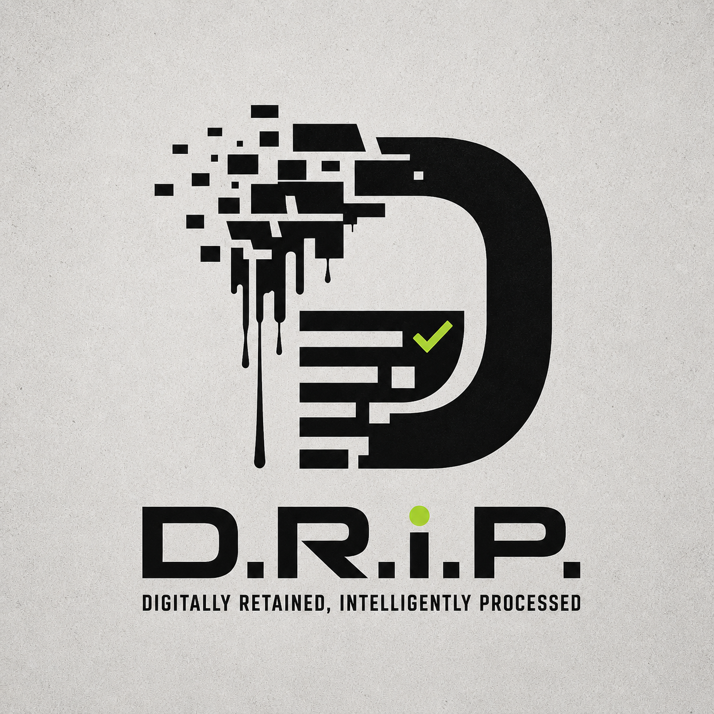

  

<h1 align="center">D.R.I.P. — Digitally Retained. Intelligently Processed.</h1>

  
  
  
  
  

<strong>Everything you've saved, archived as clean PDFs you actually own — faithfully, with nothing made up.</strong>

---

You save things constantly — articles, posts, bookmarks, videos — and never go back to them. Your "saved" tab is a graveyard.

**D.R.I.P. turns that graveyard into a library.** Every morning it reads what you saved across X, Instagram, Facebook, YouTube, TikTok, LinkedIn, and your browser bookmarks, and writes each item to disk as a clean PDF (plus a Markdown copy) — the real content of what you saved, sorted into folders by topic. By the time you sit down, it's done. You read what you saved, on your terms, offline, forever.

---

## The one promise that matters: it doesn't make things up

D.R.I.P. v2 is **extract-only.** Each PDF contains the actual text of the page or post you saved — cleaned up and laid out, with its title, source, date, and link — and **nothing else.** No AI-written summaries pretending to be the source. No invented steps, tips, or "action plans." No fabricated quotes or facts.

Every line in every PDF traces back to the thing you bookmarked. If someone asks *"where did this come from?"* the answer is always the same: **from the source you saved.**

That sounds obvious. It isn't — most "AI" tools quietly rewrite, embellish, and hallucinate. D.R.I.P. deliberately doesn't. It archives. That's the product.

---

## What it does

- **Reads your saves across 7 sources** — X bookmarks, Instagram saves, Facebook saves, YouTube (Watch Later + Liked), TikTok favourites, LinkedIn saves, and browser bookmarks (Chrome / Brave / Edge / Safari).
- **Archives each one as a source-faithful PDF + Markdown** — the real content, with title, source, date, and a clean link.
- **Sorts everything into topic folders** automatically (Tech, Business, Health, Travel, and so on), with anything low-confidence dropped into an `Unsorted/` folder for you to glance over.
- **Runs itself every morning at 8 AM** via your OS's native scheduler. You do nothing after setup.
- **Keeps your data yours.** Sorting can run on a fully local AI (free, private) or a cloud key if you prefer — and the *content of your PDFs never depends on it.*

---

## What's new in v2 — the safety rebuild

v1 tried to be clever and "improve" your content with AI. That produced confident, well-formatted documents that didn't always match what you actually saved. v2 throws that out and does the honest thing instead:

- **Extract-only output.** The document body is your source text, verbatim. No AI writes it. (The themed "recipe table / workout plan / strategy guide" generators from v1 are gone — and with them, any chance of fabrication.)
- **Content floor.** Empty pages, login walls, and cookie-banner shells never become PDFs. No body, no document.
- **Bookmark triage.** Homepages, sign-in pages, and utility shortcuts are filtered out, so only the things you actually saved to *read* get archived. You stay in control via a plain-text rules file.
- **URL sanitization.** Any auth token, session id, or signed-URL signature is stripped before a link is ever stored or shown. Your secrets never land in a file.
- **A kill switch.** A single safety flag governs all output — belt-and-braces for a tool that runs unattended.

If you bought v1: this update is **free.**

---

## Why it never downloads your videos

Most tools that handle video download the whole file — gigabytes of storage and grey-area territory with platform terms. D.R.I.P. doesn't. It reads **captions/subtitles only**. For the rare video with no captions, it pulls audio to a temporary file, transcribes it locally, and deletes the audio the moment it's done. Full video files are never stored. Your disk stays clean; the text of what you saved is preserved.

---

## Private by design

- Runs on **your machine.** Nothing is uploaded, synced, or sold.
- Uses your **existing browser session** — no passwords, no third-party logins. Cookies stay local.
- Sorting can run on a **local AI** (Ollama / LM Studio) so your content never leaves the device at all. A cloud key (Claude / GPT / Grok) is optional and only ever sees a short snippet for *folder routing* — never to write your documents.

---

## Cross-platform

Runs natively on **macOS, Windows, and Linux.** One installer per system, OS-native daily scheduling (launchd / systemd / Task Scheduler), identical output everywhere.

---

## Get it

**[Buy on Gumroad — $39, one-time. No subscription.](https://thebvl.gumroad.com/l/rvwbcv)**

One payment. Yours forever. Free updates — including this v2 safety rebuild.

---

## Support

Questions or trouble? Contact **Business Venture Link** at info@thebvl.com.

The full setup guide, FAQ, and AI options ship inside the product.

---

<em>Built for people who save things they mean to come back to — but never do.</em>

© Business Venture Link. All rights reserved.

